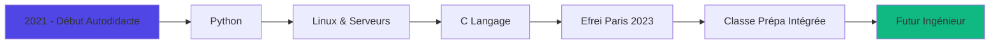

# 🚀 Guillaume Béranger | Développeur Autodidacte

  

---

## 🎯 Qui suis-je ?

> *"Le code est la poésie de la logique"* ✨

Passionné de développement depuis **2021**, j'ai choisi la voie de l'autodidaxie pour maîtriser l'art du code. Actuellement en **2ème année de classe préparatoire intégrée internationale** à **Efrei Paris**, je combine rigueur académique et créativité technique.

### 🌍 Localisation
- **📍 Région parisienne, France** 🇫🇷
- **🎓 Efrei Paris** - École d'ingénieur en informatique

---

## 🛠️ Mon Arsenal Technique

### 💻 Langages de Programmation

  
  
  
  

### 🔧 Outils & Environnements

  
  
  
  
  

---

## 🚀 Mon Parcours

---

## 🎯 Mes Objectifs

- 🔥 **Maîtriser** les architectures distribuées
- 🌐 **Développer** des solutions innovantes
- 🤝 **Collaborer** sur des projets open-source
- 📚 **Partager** mes connaissances avec la communauté

---

## 📊 Mes Stats GitHub

  

---

## 🎵 Code & Musique

*Quand je code, j'écoute souvent :*
- 🎧 **Lo-Fi** pour la concentration
- 🎵 **Classique** pour la logique
- 🎶 **Jazz** pour la créativité

---

## 📫 Connectons-nous !

  
  
  
  
  

---

  
  
  
  *Merci de votre visite ! 👋*
  

